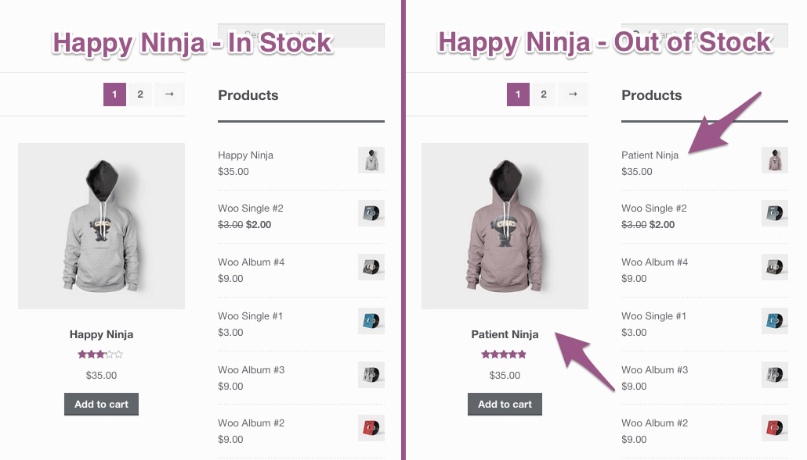

<!-- DO NOT EDIT THIS FILE; it is auto-generated from readme.txt -->
# WooCommerce Product Fallbacks

Automatically display another product in place of an out-of-stock product.

**Contributors:** [fjarrett](https://profiles.wordpress.org/fjarrett)  
**Tags:** [ecommerce](https://wordpress.org/plugins/tags/ecommerce)  
**Requires at least:** 4.0  
**Tested up to:** 4.2  
**Stable tag:** 1.0.0  
**License:** [GPLv3](https://www.gnu.org/licenses/gpl-3.0.html)  
**WC requires at least:** 2.1.0  
**WC tested up to:** 2.3.8  

## Description ##

Automatically display another product in place of an out-of-stock product.

## Frequently Asked Questions ##

### I have a question? ###
This is the answer.

## Screenshots ##

### List product fallbacks in order of priority from the Linked Products tab.

### When products are out-of-stock they are automatically replaced by their fallback product.

## Changelog ##

### 1.0.0 - May 20, 2015 ###
* Initial release

Props [fjarrett](https://github.com/fjarrett)

